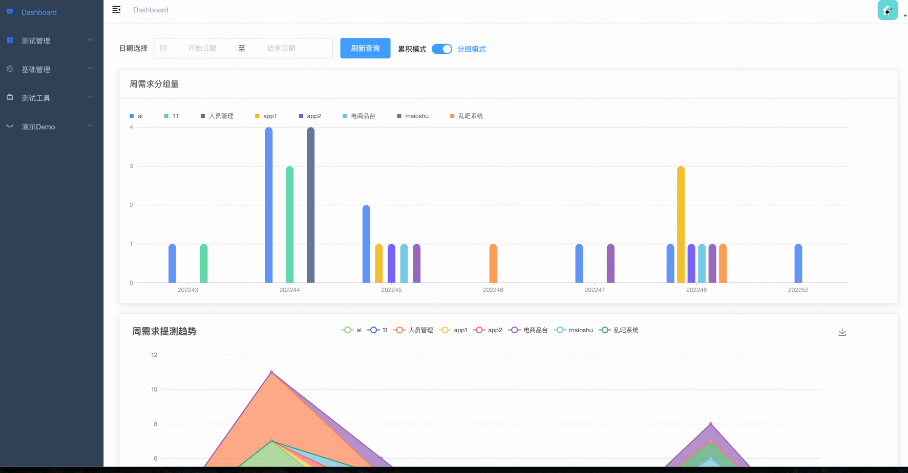
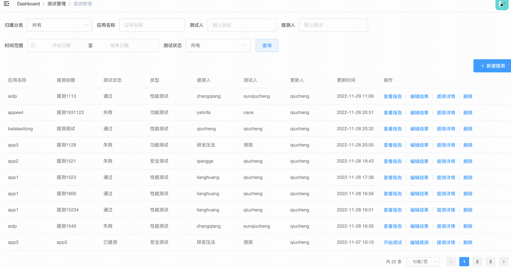
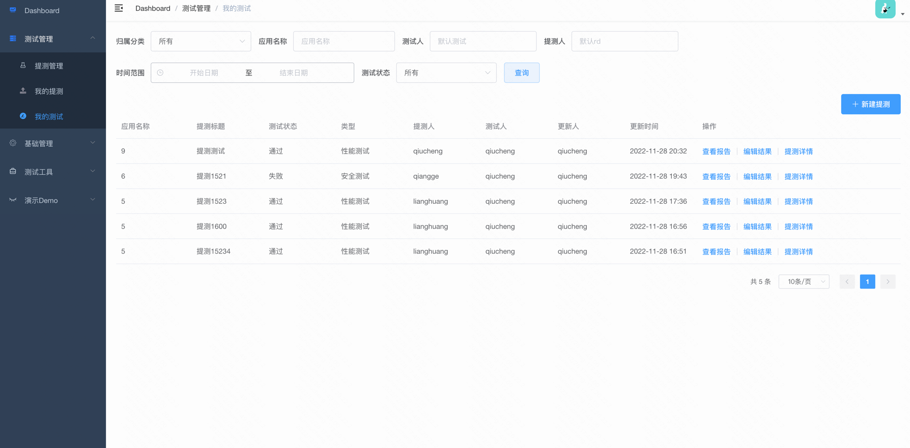
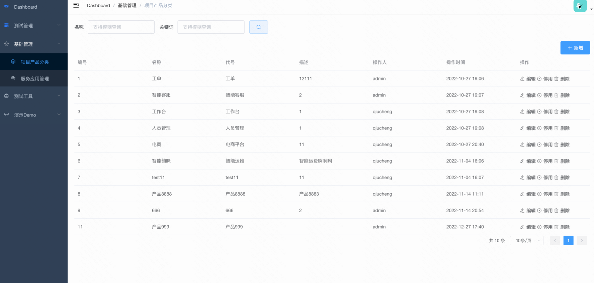
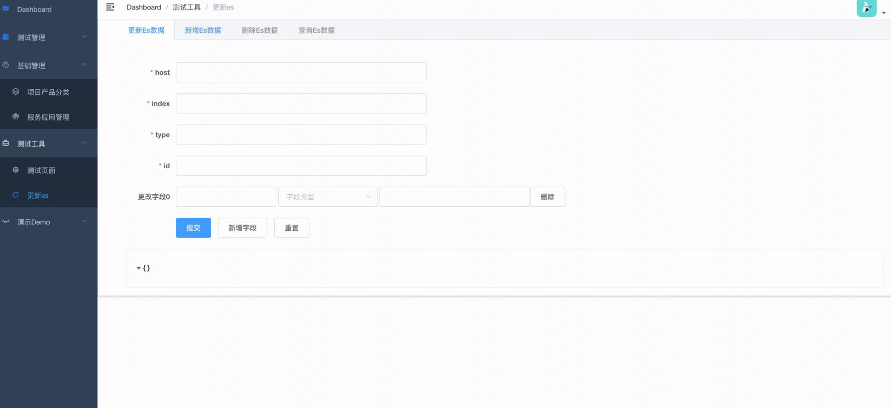

# 前后端服务
代码全部放在一个Git项目上了，但服务分为独立的前端和后端服务，同时也给出了对应SQL数据库创表语句。

## SQL
数据使用的Mysql，版本建议5.7+，本项目中使用的是8.0版本，SQL文件夹中分别提供的提测平台用到的几张表


## STPService
后端服务，使用的是 Python Flask框架，Pyton版本是3.x，同样本项目讲解的是需求应用的部分，至于更多内容建议学习官网 [英文](https://flask.palletsprojects.com/en/2.0.x/) [中文](https://dormousehole.readthedocs.io/en/latest/)，英文好的强力推荐阅读英文官方版本，中文的翻译可能是老版本，相关内容有些滞后。

### 如何运行

```bash
# 克隆项目
git clone https://github.com/sunqc666/SubmitTestPlatform.git

# 进入项目目录 或 用WebStorm等IDE工具导入前端项目
cd STPService

# 安装依赖
pip3 install -r requirements.txt

# 启动服务 或者 PyCharm等IDE配置运行
python3 app_old.py

```

## STPWeb
前端服务，使用的是开箱即用的 [Vue-element-admin](https://github.com/PanJiaChen/vue-admin-template)基础template版本，它还有个amdin版本有很多综合页面可以进行参考，基础组件应用上使用的 [Element ui](https://element.eleme.io/#/zh-CN)，这里需要注意的是你代码中使用的是Vue2.x版本，如果你是刚刚开始跟学这个项目，可以尝试将这些都升级到3.x进行练习开发。

关于前端的Vue开发，本项目只是讲了如何快速的应用，而不是深入的讲解vue前端开发的技能，在分享文章里也讲过，我们并不是要做前端开发，所以对于全栈的测试开发只要掌握如何应用到实际需求中就行，如果想进一步深入学习，可以参考Vue-element-admin、Vue等技术官网或者相关专业课程。

### 如何运行

```bash
# 克隆项目


# 进入项目目录 或 用WebStorm等IDE工具导入前端项目
cd STPWeb

# 安装依赖
npm install

# 启动服务
npm run dev

# 如果npm install安装较慢可切换依赖源
npm install --registry=https://registry.npm.taobao.org

```
浏览器访问 [http://localhost:9528](http://localhost:9528)

### 感谢
这里鸣谢 Vue-element-admin个人 和 element ui团队的无私奉献，才让前端的开发更简单。

### 页面效果




